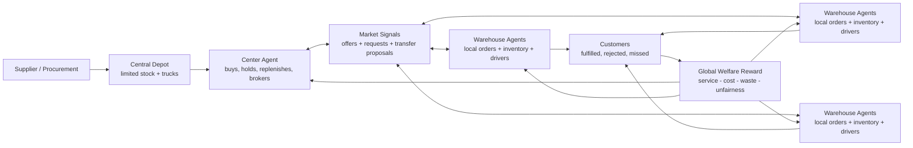
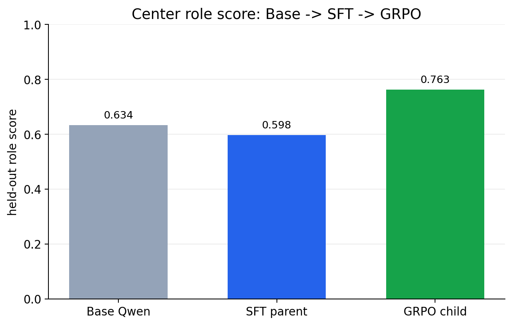
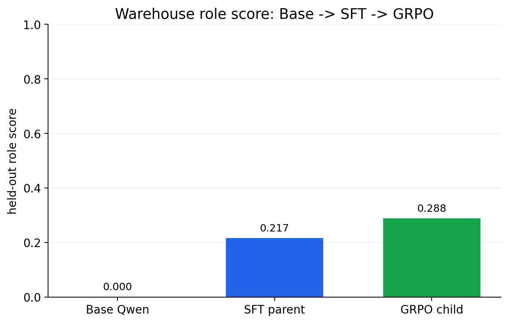
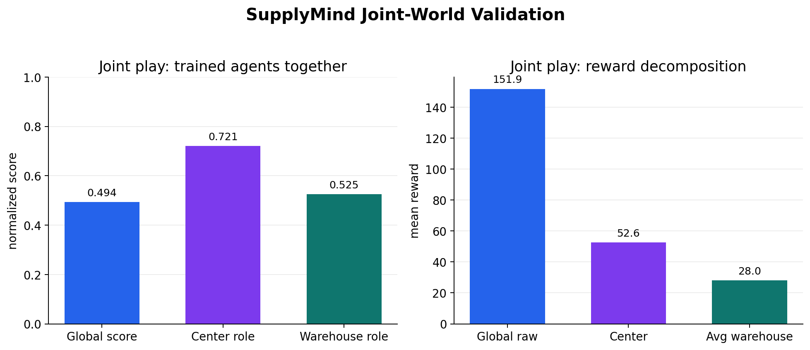
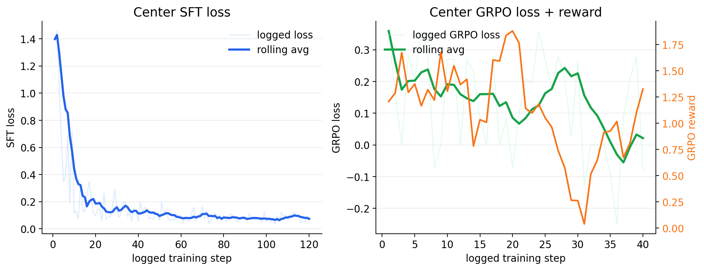

# SupplyMind: Training LLM Agents to Coordinate Under Scarcity

## TL;DR

SupplyMind is an OpenEnv environment for training LLM agents to coordinate a regional supply network when inventory is scarce, information is incomplete, and every local decision has delayed consequences.

The benchmark asks one question:

**Can an LLM learn to coordinate when nobody sees the full truth, every warehouse has local incentives, and bad decisions only become obvious several rounds later?**

SupplyMind is not a grid world, board game, or single-agent inventory toy. It is a multi-agent operations environment where:

- the center sees compressed demand reports, not raw customer orders
- warehouses see local orders, but not the full network
- procurement takes time
- trucks and drivers are limited
- inventory can be in the wrong place
- transfers cost money
- overreaction creates spoilage and leftover penalties
- unfairly starving one region hurts the final score

The official score is global welfare. The agent wins only by improving the network, not by moving money around inside it.

Demo: [rishavutk/supplymind](https://huggingface.co/spaces/rishavutk/supplymind). The Space is playable in the browser with the built-in heuristic strategy, so reviewers can inspect a full episode interactively before looking at the training results.

## The Scenario

Imagine a regional quick-commerce network during a shortage.

North warehouse is running out of insulin packs. West has surplus inventory, but West also has its own safety stock target and does not want to take local risk. The central coordinator can see that North is under pressure, but it cannot see every raw customer order. If the center waits, urgent demand may be missed. If it sends too much stock, another region may be exposed later. If it forces a transfer without fair compensation, the warehouse agents may reject future cooperation.

That is the core of SupplyMind.

The challenge is not "choose the largest number" or "route one vehicle." The challenge is coordination under scarcity: when to buy, when to hold, when to ship, when to broker a trade, when to respect local safety stock, and when to accept short-term cost to prevent a larger network failure.

This is exactly the kind of repeated, partially observable decision problem where current LLM agents are interesting but unreliable. They can explain tradeoffs in language, but can they learn a policy that actually improves reward over many rounds?

## Why This Environment Exists

Many real operational failures are not dramatic. They are boring in a way that makes them hard to benchmark:

- the right product exists, but in the wrong warehouse
- local teams protect their own service levels
- the central planner sees summaries instead of ground truth
- a shipment that looks expensive now prevents a stockout later
- a cheap decision now creates spoilage, waste, or unfairness at the end
- good coordination requires repeated trust, not one perfect action

SupplyMind turns those failures into a trainable environment.

The result is a benchmark that is practical enough to understand in one minute, but rich enough to expose real agent behavior: planning, negotiation, local/global tension, invalid action handling, and delayed reward credit assignment.

## The World

SupplyMind has two trainable role surfaces.



### Center

The center is the network coordinator. It can:

- procure new stock into the central depot
- replenish warehouses from depot inventory
- broker warehouse-to-warehouse offer/request matches
- propose direct transfers
- hold inventory for later rounds

The center sees warehouse summaries, inventory pressure, market signals, price bands, depot stock, truck capacity, feedback, and reward components. It does not see raw customer orders.

### Warehouses

Each warehouse is a local agent. It can:

- accept or reject local customer orders
- publish inventory offers
- publish inventory requests
- accept or reject transfer proposals
- set local fulfillment priorities

Warehouses see their own orders and local constraints, but not the entire future demand pattern of the network.

That information asymmetry is the point. The environment is not one controller pretending to be many agents. The roles have different information, different incentives, and different failure modes.

### Products

The environment tracks four products as representatives of the kinds of items a real warehouse network stocks:

- `fresh_milk`: perishable, high-turnover inventory where over-ordering creates waste
- `rice_bag_5kg`: staple demand where stockouts hurt broad service quality
- `insulin_pack`: urgent health-critical inventory where missed demand is especially costly
- `usb_c_charger`: higher-value retail inventory where margin, timing, and regional demand bursts matter

The point is not that these four SKUs are the whole supply chain. They are a compact test set: perishables, staples, critical medical stock, and higher-value retail goods all create different coordination pressure.

## What Makes SupplyMind Novel

The strongest claim is not "we simulated a warehouse."

The strongest claim is:

**SupplyMind tests whether LLM agents can learn coordination under misaligned local incentives and incomplete information.**

What makes the environment stand out:

- **Explicit multi-agent roles**: center and warehouses act through different action surfaces.
- **Partial observability**: the center gets reports, not raw orders or hidden future demand.
- **Negotiation mechanics**: warehouses publish offers and requests; the center can broker or propose compensated transfers.
- **Delayed consequences**: procurement lead time, route cost, driver capacity, spoilage, holding cost, and terminal penalties make myopic behavior fail.
- **Local versus global tension**: warehouses have local utility, but the official benchmark score is global welfare.
- **Reward-hacking resistance**: transfer count is not directly rewarded in the global score; transfers matter only if they improve fulfillment, reduce stockouts, reduce waste, or improve fairness.
- **Research-shaped difficulty**: the environment naturally supports curriculum training, held-out seeds, role-specific training, baselines, and reference policies.

This is where SupplyMind should score strongest: the environment is built around a problem that is underexplored for LLM training.

## Tasks and Difficulty

SupplyMind includes deterministic training and benchmark tiers:

- `train_easy`: 3 warehouses, 12 rounds
- `train_medium`: 4 warehouses, 18 rounds
- `train_hard`: 5 warehouses, 24 rounds
- `easy`: 3 warehouses, 18 rounds
- `medium`: 4 warehouses, 26 rounds
- `hard`: 5 warehouses, 34 rounds

Seeds generate different demand motifs: stable demand, understock, perishable pressure, regional shifts, transfer-needed cases, premium bursts, and tight-SLA pressure.

This gives the environment two properties judges care about:

- runs are reproducible
- policies can be compared on held-out tasks instead of one lucky demo seed

## Action Space

The joint action controls both center and warehouse behavior.

Warehouses submit local decisions:

```json
{
  "warehouse_actions": {
    "north": {
      "order_decisions": [{"order_id": "o1", "decision": "accept"}],
      "inventory_offers": [{"sku": "fresh_milk", "units": 2, "ask_price": 6.0}],
      "inventory_requests": [{"sku": "insulin_pack", "units": 2, "max_price": 12.0}],
      "transfer_responses": [{"proposal_id": "p1", "decision": "accept"}],
      "local_priority": [{"sku": "insulin_pack", "priority": 3}]
    }
  }
}
```

The center submits network actions:

```json
{
  "central_action": {
    "central_procurements": [{"sku": "fresh_milk", "units": 4, "max_unit_cost": 4.0}],
    "central_replenishments": [{"to_warehouse": "north", "sku": "fresh_milk", "units": 2, "unit_price": 6.0}],
    "inventory_transfer_proposals": [{"from_warehouse": "west", "to_warehouse": "north", "sku": "rice_bag_5kg", "units": 2, "compensation": 10.0}],
    "offer_matches": [{"offer_signal_id": "west:offer:rice_bag_5kg", "request_signal_id": "north:request:rice_bag_5kg", "units": 2, "compensation": 10.0}]
  }
}
```

The action space is intentionally structured. It is readable enough for an LLM, strict enough for validation, and expressive enough to create real strategy.

## Reward Design

The official reward is one scalar global welfare score per step:

```text
step_reward =
  fulfilled_order_value
+ order_reject_penalties
+ accepted_missed_penalties
+ silent_expiry_penalties
+ center_wholesale_terms
+ warehouse_local_terms
- procurement_cost
- center_shipment_cost
- transfer_cost
- stockout_penalty
- holding_cost
- spoilage_cost
- terminal_leftover_penalty
- terminal_fairness_penalty
- invalid_action_penalty
```

The important design choice is that internal payments are tracked but not allowed to become fake global value.

The center may receive role-specific broker rewards for learning and diagnostics, but the official global welfare score does not reward transfer volume directly. A useless transfer is just cost. A useful transfer improves the score only later, through better fulfillment, lower stockouts, lower spoilage, or better fairness.

This makes the reward informative without being easy to exploit.

## Anti-Hacking Checks

SupplyMind includes several reward-integrity defenses:

- invalid payload and invalid action penalties
- stockout penalties
- accepted-but-missed order penalties
- holding and spoilage costs
- terminal leftover penalties
- terminal fairness penalties
- no direct global reward for transfer count
- audit metrics for stockouts, transfers, broker fees, invalid actions, leftovers, spoilage, and service rates

That matters because a good OpenEnv submission should not only run. It should teach the agent the right thing.

## Training Pipeline

SupplyMind exposes three training/evaluation modes:

- `/v2/center/*`: train the center while warehouses are frozen to a deterministic heuristic
- `/v2/warehouse/*`: train a shared warehouse policy while the center is frozen to a deterministic heuristic
- `/v2/step`: evaluate the joint policy

This staged design is deliberate. Fully joint multi-agent RL is hard, especially with small models and hackathon compute. Instead of asking two unstable policies to learn at once, SupplyMind trains one side while freezing a strong version of the other side.

The training loop has two flavors:

1. **Warehouse agent training**: freeze the center with a strong heuristic, then train the warehouse policy to accept sensible orders, request needed stock, offer surplus, and respond to transfers.
2. **Center agent training**: freeze the warehouses with a strong heuristic, then train the center policy to procure, replenish, and broker transfers.
3. **Joint play**: put the trained role policies back into the full `/v2/step` environment and let them coordinate together.

This matters because each role learns against a stable world first, then the final evaluation tests whether those learned behaviors work together.

The repo includes role-specific training scripts, Hugging Face job logs, parsed evaluation artifacts, and policy evaluation scripts.

## Evidence

SupplyMind already has reproducible benchmark anchors over nine benchmark episodes:

```text
policy                 mean_score   mean_reward   episodes
no_op                  0.0001       -2103.854     9
naive_joint            0.0500        -173.873     9
heuristic_joint        0.6625         440.507     9
privileged_reference   0.9500         709.348     9
```

This scale is useful:

- `no_op` shows the cost of doing nothing
- `naive_joint` is the normalized baseline
- `heuristic_joint` proves the environment has meaningful strategy
- `privileged_reference` is a strong anchor, not a claimed mathematical optimum

We trained role policies with an SFT warm-start followed by GRPO. Held-out role evaluation used seeds `131, 149, 163`.

| Role | Policy | Global score | Role score | Raw reward | Invalid payloads | Invalid actions |
|---|---|---:|---:|---:|---:|---:|
| warehouse | Base Qwen 0.5B | 0.0001 | 0.0001 | -864.40 | 36 | 0 |
| warehouse | SFT parent | 0.2343 | 0.2166 | 26.05 | 0 | 69 |
| warehouse | GRPO child | 0.2801 | 0.2881 | 58.73 | 1 | 58 |
| center | Base Qwen 0.5B | 0.5172 | 0.6336 | 176.12 | 36 | 0 |
| center | SFT parent | 0.5327 | 0.5977 | 186.56 | 0 | 22 |
| center | GRPO child | 0.6469 | 0.7626 | 239.21 | 0 | 0 |

After submission, I also ran a small Colab-limited trial with `Qwen/Qwen2.5-3B-Instruct`, loaded in 4-bit with LoRA adapters, using the same center-role SFT -> GRPO recipe. I treat this as a reproducibility and scaling check rather than a headline result: it confirmed that the same environment and reward loop can run on a stronger policy and still produce on-policy GRPO signal, but it was not tuned enough to replace the cleaner submitted evidence below.





The training evidence is simple:

- **Base behavior was unreliable**: the untrained/base policy often produced invalid or low-quality actions.
- **SFT made the models usable**: supervised warm-starting taught the action format and basic role behavior.
- **GRPO improved the promoted role policies**: the center role improved strongly, and the warehouse role showed a smaller but measurable improvement over its SFT parent.
- **Joint play validates interaction**: after role training, the promoted center and warehouse policies were run together in the shared environment.

In the joint validation rollout, the promoted trained policies achieved:

```text
global score                 0.4941
raw global reward            151.91
center role score            0.7206
warehouse role score         0.5254
center reward                 52.59
average warehouse reward      28.04
```



We use this joint rollout as validation that the trained role policies can interact coherently in the same multi-agent world. The main improvement claim remains the cleaner held-out role-training result above.

The center GRPO run also shows the expected noisy-but-useful RL signal: loss alone is not the whole story, so we track reward and invalid actions alongside it.



The honest claim is:

**SupplyMind has a working training and evaluation pipeline, meaningful reward signal, reproducible baselines, and evidence that role behavior can be shaped with SFT plus GRPO.**

## Why This Fits The Judging Criteria

### Environment Innovation

SupplyMind's strongest category.

This is not a clone of chess, snake, tic-tac-toe, or a small grid-world. It is a fresh LLM-agent training problem grounded in real operations: partial observability, local incentives, delayed procurement, scarce inventory, transfer negotiation, and fairness.

The environment tests behavior that general LLMs often talk about well but do not reliably execute over time: coordination, restraint, negotiation, and long-horizon tradeoffs.

### Showing Improvement in Rewards

The project includes:

- deterministic policy evaluation
- baseline and reference scores
- role-specific training logs
- reward batches
- invalid payload tracking
- parsed artifacts for train/validation/test visibility

The presentation should be honest: the policy is not "solved," but the environment is demonstrably trainable and produces interpretable learning signals.

### Presentation

The demo should start with a human scenario, not an API.

Start here:

> North needs insulin. West has surplus. The center sees pressure, not raw orders. A transfer can save urgent demand, but it costs money and may expose West later.

Then show:

- the center view
- the warehouse view
- one bad baseline decision
- one better coordinated decision
- the reward breakdown explaining why it was better

That turns the environment into a concrete scenario a non-technical judge can follow.

### Reward and Training Pipeline

The reward is coherent because it matches the real objective: global welfare.

It rewards fulfilled demand and penalizes the real costs of bad coordination: procurement, shipping, transfer friction, holding, spoilage, stockouts, leftovers, unfairness, and invalid actions.

The training pipeline is coherent because center and warehouse roles can be trained separately before joint evaluation.

## Demo Plan

The best demo is short, visual, and evidence-driven:

1. Open with the insulin shortage scenario.
2. Show that the center cannot see raw local orders.
3. Show warehouse offers and requests appearing as market signals.
4. Run the naive or no-op policy and show missed demand / stockouts.
5. Run the heuristic or trained role policy on the same seed.
6. Show the reward breakdown: fulfilled value up, stockouts down, waste controlled, invalid actions tracked.
7. End with the benchmark claim: this is trainable coordination under scarcity.

The line judges should remember:

**SupplyMind is not asking whether an LLM can answer a supply-chain question. It asks whether an LLM can learn to run a supply network when information is incomplete and every decision has consequences.**

## Final Position

SupplyMind is ambitious in the way a winning OpenEnv submission should be ambitious.

It is original, but understandable.

It is hard, but measurable.

It has real reward structure, not a decorative score.

It has baselines, reference anchors, role-specific training surfaces, and early training evidence.

Most importantly, it teaches something interesting: coordination under scarcity.

That is the core claim.
